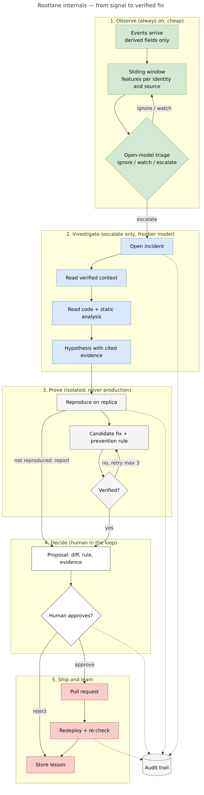
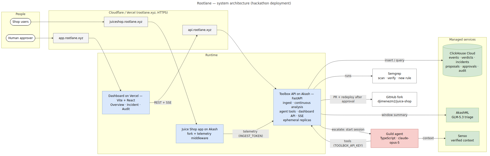
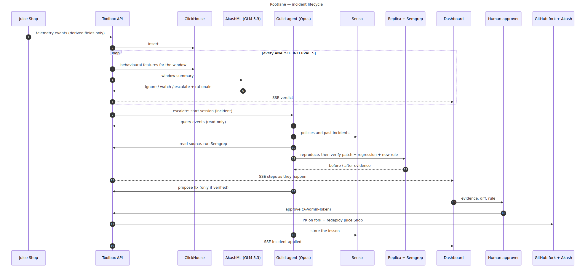
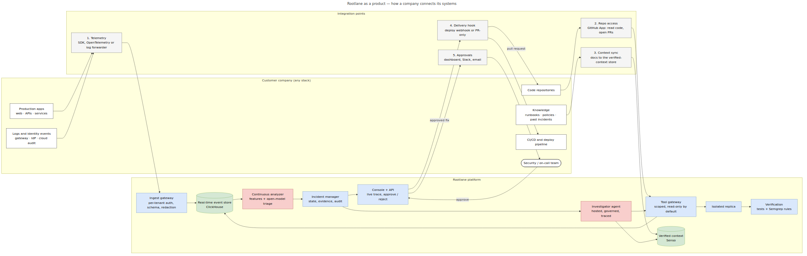

# Rootlane

**An autonomous security agent that watches a live app, investigates what looks wrong, and proves a fix before a human ships it.**

**Try it:** [Dashboard](https://app.rootlane.xyz) · [Watched app (OWASP Juice Shop)](https://juiceshop.rootlane.xyz) · [Rootlane API](https://api.rootlane.xyz/healthz)

## Why

Broken Access Control is #1 in the OWASP Top 10:2025:

> "100% of the applications tested were found to have some form of broken access control."
> — [OWASP A01:2025 Broken Access Control](https://top10.owasp.org/2025/A01_2025-Broken_Access_Control)

Detectors raise alerts; someone still has to find the root cause, prove a fix and ship it. Rootlane closes that loop with an agent that investigates with evidence, verifies its own patch, and never ships without a human.

## What happened in our live run

Incident `inc_20261009234748`, on the live system, 2026-10-09 23:47–23:50 UTC:

1. **Telemetry** from Juice Shop streamed into ClickHouse.
2. **The continuous analyzer escalated** on a deterministic identity rule: *authenticated responses for a principal with no prior login from that client*.
3. **An incident opened** and Guild **started the investigating agent automatically** through its API trigger (`claude-opus-5`).
4. The agent ran **4 read-only ClickHouse queries** over the telemetry.
5. It **read 4 source files**: `lib/insecurity.ts`, `routes/login.ts`, `routes/verify.ts`, `routes/userProfile.ts`.
6. **Semgrep returned 3 findings** on that code.
7. It **reproduced the issue on an isolated replica** (HTTP 200).
8. **The verifier rejected the agent's first patch and rule drafts.** That is the guardrail working: nothing ships unverified. Patch verification is the step we are hardening now.

Every tool call is audited in ClickHouse with its Guild session id.

## How it works





| Phase | What happens | Powered by |
| --- | --- | --- |
| 1. Observe | Every ~10 s, behavioural features per principal and IP go to a triage model that answers `ignore` / `watch` / `escalate` with a one-line rationale; a deterministic identity rule runs alongside. | AkashML `zai-org/GLM-5.3`, ClickHouse |
| 2. Investigate | On `escalate`, an agent queries telemetry, reads the source, runs Semgrep and cites verified policy. | Guild (`claude-opus-5`), Senso, Semgrep |
| 3. Prove | Reproduce on an isolated replica, apply the patch, replay, run regressions. | Ephemeral replica sandbox, Semgrep |
| 4. Decide | A human reviews the evidence and approves or rejects. | Dashboard |
| 5. Ship | The approved fix becomes a PR on the app's repository. | GitHub |

Detection is generic behaviour plus model judgement: nothing in the analyzer or the agent is written for one vulnerability.

## Built with the sponsors

| Sponsor | What it does in Rootlane | Where to see it |
| --- | --- | --- |
| **Guild** | Hosts, scopes and traces the investigating agent; its API trigger starts a session on every escalation. | Agent: [backend/agent/](backend/agent/) · session ids in the audit trail |
| **ClickHouse** | Real-time backbone: telemetry, window features in SQL, verdicts, incidents and the agent audit log. | [Dashboard](https://app.rootlane.xyz) · [schema](backend/rootlane_toolbox/storage/schema/) |
| **AkashML** | Always-on triage with `zai-org/GLM-5.3`: a verdict and rationale every ~10 s. | Live verdict feed on the [dashboard](https://app.rootlane.xyz) |
| **Akash** | Hosts the watched app and the Rootlane API with its replica sandbox. | [juiceshop.rootlane.xyz](https://juiceshop.rootlane.xyz) · [api.rootlane.xyz](https://api.rootlane.xyz/healthz) |
| **Senso** | Holds 4 verified policy and runbook documents the agent searches and cites. | Policy citations in the agent's investigation steps |
| **Semgrep** | Scans the code under investigation, verifies the patch closes the finding, and writes a prevention rule. | Findings in the agent's investigation steps |
| Pi | Not used: no product access at the event. | — |

## Architecture & integration

Three deployments: the dashboard on Vercel, Juice Shop with a telemetry middleware on Akash, and the Rootlane API on Akash. The API ingests telemetry, runs the analyzer, opens incidents, streams them to the dashboard over Server-Sent Events, and exposes the scoped tools the Guild agent calls.



As a product, Rootlane plugs into a company at five points: telemetry, code, knowledge, deploy and approvals.



All diagrams and their Mermaid sources: [docs/diagrams/](docs/diagrams/README.md).

## Security by design

- **Derived telemetry only:** status, route, timings, auth outcome and identity signals. Never passwords, tokens or request bodies.
- **Read-only, scoped tools:** the agent holds one least-privilege key; queries, source reads and scans cannot write.
- **Human approval gate:** shipping a fix requires an admin decision in the dashboard.
- **Full audit trail:** every agent tool call is stored in ClickHouse with its Guild session id.
- **Replica isolation:** reproductions and patches run on an ephemeral replica, never on the live app.
- **No secrets in git:** they live only in each deployment's environment. This repository is public.

## Repo

```
backend/     Rootlane API (Python, FastAPI) + backend/agent/ (Guild agent, TypeScript)  -> api.rootlane.xyz
frontend/    dashboard (Vite + React) + fixtures/ (API contract samples)                -> app.rootlane.xyz
juiceshop/   Juice Shop fork (submodule), telemetry middleware, patches, Dockerfile      -> juiceshop.rootlane.xyz
docs/        design spec, diagrams, research, dashboard contract
```

- Run the API and agent: [backend/README.md](backend/README.md)
- Run the dashboard: [frontend/README.md](frontend/README.md)
- Design and decisions: [docs/superpowers/specs/2026-10-09-rootlane-design.md](docs/superpowers/specs/2026-10-09-rootlane-design.md)
