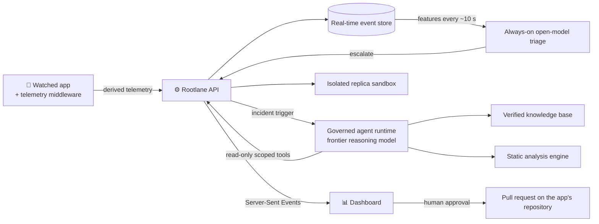

<div align="center">

# 🛡️ Rootlane

**An autonomous security agent that watches a live app, investigates what looks wrong, and proves a fix before a human ships it.**


### [▶ Live dashboard](https://app.rootlane.xyz) &nbsp;·&nbsp; [🧃 Watched app](https://juiceshop.rootlane.xyz) &nbsp;·&nbsp; [⚙️ API](https://api.rootlane.xyz/healthz)

</div>

---

## The problem

Broken Access Control is #1 in the OWASP Top 10:2025:

> "100% of the applications tested were found to have some form of broken access control."
> — [OWASP A01:2025 Broken Access Control](https://top10.owasp.org/2025/A01_2025-Broken_Access_Control)

Detectors raise alerts; someone still has to find the root cause, prove a fix and ship it. **Rootlane closes that loop** with an agent that investigates with evidence, verifies its own patch, and never ships without a human.

## Live run

Incident `inc_20261009234748`, on the live system, 2026-10-09 23:47–23:50 UTC:

| # | Step |
| :-: | --- |
| 1 | **Streamed** telemetry from Juice Shop into the real-time event store. |
| 2 | **Escalated** on a deterministic identity rule: *authenticated responses for a principal with no prior login from that client*. |
| 3 | **Opened** an incident; the governed agent runtime **started** the investigating agent automatically through its API trigger. |
| 4 | **Queried** the telemetry with 4 read-only queries. |
| 5 | **Read** 4 source files: `lib/insecurity.ts`, `routes/login.ts`, `routes/verify.ts`, `routes/userProfile.ts`. |
| 6 | **Scanned** that code: the static analysis engine returned 3 findings. |
| 7 | **Reproduced** the issue on an isolated replica (HTTP 200). |
| 8 | **Rejected**: the verifier refused the agent's first patch and rule drafts. That is the guardrail working: nothing ships unverified. Patch verification is the step we are hardening now. |

Every tool call is audited in the event store with its agent session id.

## How it connects



The dashboard runs on static hosting behind an edge network & DNS; the watched app and the Rootlane API run on decentralized compute.

| Phase | What happens |
| --- | --- |
| 1. **Observe** | Every ~10 s, behavioural features per principal and IP go to a triage model that answers `ignore` / `watch` / `escalate` with a one-line rationale; a deterministic identity rule runs alongside. |
| 2. **Investigate** | On `escalate`, an agent queries telemetry, reads the source, runs static analysis and cites verified policy. |
| 3. **Prove** | Reproduce on an isolated replica, apply the patch, replay, run regressions. |
| 4. **Decide** | A human reviews the evidence in the dashboard and approves or rejects. |
| 5. **Ship** | The approved fix becomes a PR on the app's repository. |

Detection is generic behaviour plus model judgement: nothing in the analyzer or the agent is written for one vulnerability.

<details>
<summary><b>📐 Architecture diagrams</b></summary>


As a product, Rootlane plugs into a company at five points: telemetry, code, knowledge, deploy and approvals.


All diagrams and their Mermaid sources: [docs/diagrams/](docs/diagrams/README.md).

</details>

## Features

| | | |
| --- | --- | --- |
| 📡 **Continuous analysis**<br/>A verdict and rationale every ~10 s from behavioural features, plus a deterministic identity rule. | 🔎 **Autonomous investigation**<br/>Queries telemetry, reads source, scans code and cites 4 verified policy and runbook documents. | 🧪 **Proof on a replica**<br/>Reproduce, patch, replay and run regressions on an ephemeral replica, never the live app. |
| ✅ **Human approval**<br/>Shipping a fix requires an admin decision in the dashboard. | 🧱 **Prevention rule**<br/>The analysis engine verifies the patch closes the finding and writes a rule so it cannot return. | 📜 **Full audit trail**<br/>Every agent tool call is stored with its session id. |

## Security by design

- [x] **Derived telemetry only:** status, route, timings, auth outcome and identity signals. Never passwords, tokens or request bodies.
- [x] **Read-only, scoped tools:** one least-privilege key; queries, source reads and scans cannot write.
- [x] **Human approval gate:** no fix ships without an admin decision.
- [x] **Full audit trail:** every agent tool call is stored with its agent session id.
- [x] **Replica isolation:** reproductions and patches never touch the live app.
- [x] **No secrets in git:** they live only in each deployment's environment. This repository is public.

## Repository

```
backend/     Rootlane API (Python, FastAPI) + backend/agent/ (investigating agent, TypeScript)  -> api.rootlane.xyz
frontend/    dashboard (Vite + React) + fixtures/ (API contract samples)                        -> app.rootlane.xyz
juiceshop/   Juice Shop fork (submodule), telemetry middleware, patches, Dockerfile              -> juiceshop.rootlane.xyz
docs/        design spec, diagrams, research, dashboard contract
```

- 🐍 Run the API and agent: [backend/README.md](backend/README.md)
- ⚛️ Run the dashboard: [frontend/README.md](frontend/README.md)
- 🧭 Design and decisions: [docs/superpowers/specs/2026-10-09-rootlane-design.md](docs/superpowers/specs/2026-10-09-rootlane-design.md)
